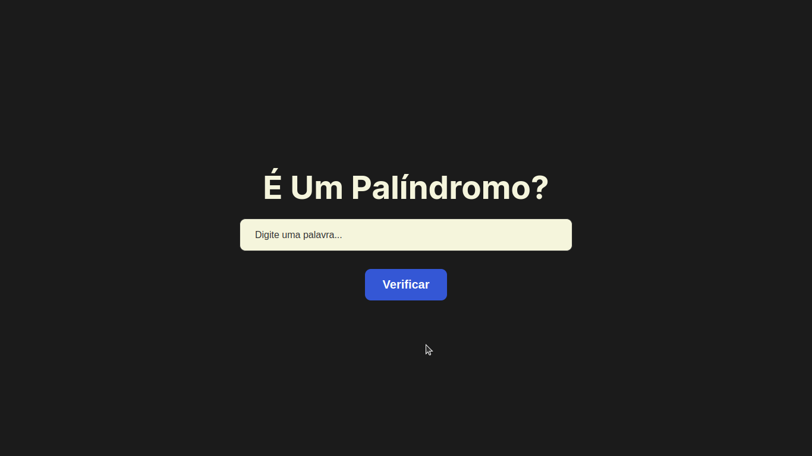
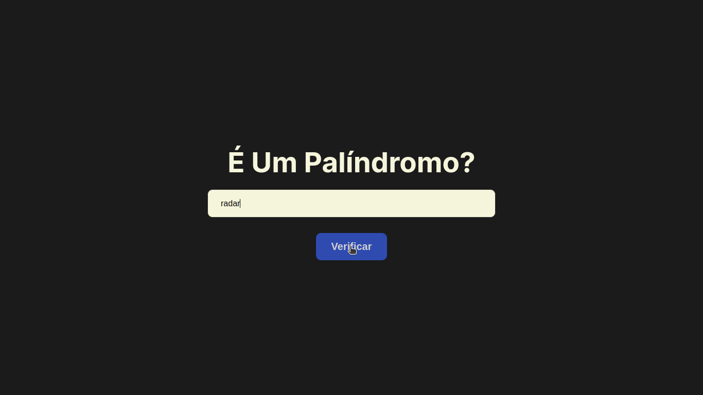
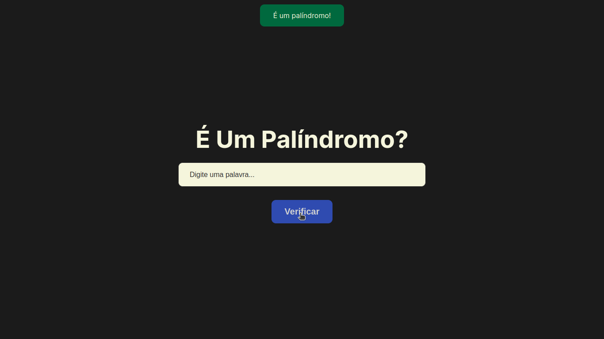
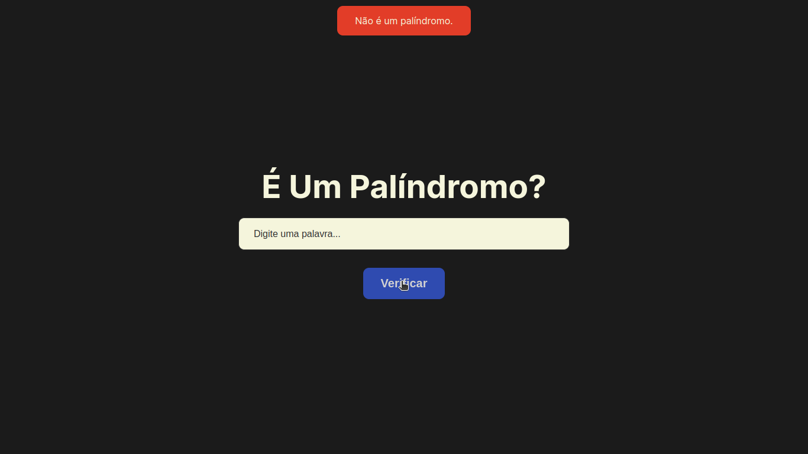

# É Um Palíndromo?

Verifique se uma palavra é ou não um palíndromo.

## Tecnologias Utilizadas

<li>JavaScript</li>
<li>HTML</li>
<li>CSS</li>

## Preview

### Tela Inicial

### É Um Palíndromo

### Não É Um Palíndromo

